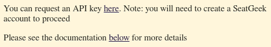

| Action         | Method | URL                                                                                                                                                  |
| -------------- | ------ | ---------------------------------------------------------------------------------------------------------------------------------------------------- |
| List Teams     | GET    | [http://localhost:8000/api/teams](http://localhost:8000/api/teams)                                                                                   |
| Team Details   | GET    | [http://localhost:8000/api/teams/{team_id}](http://localhost:8000/api/teams/0)                                                                       |
| Get Games      | GET    | [http://localhost:8000/api/games/{query_params}](http://localhost:8000/api/games?start_date=2024-05-09&end_date=2024-07-18&away_team=15&home_team=4) |
| Game Details   | GET    | [http://localhost:8000/api/games/{team_id}](http://localhost:8000/api/games/23434)                                                                   |
| Login          | POST   | [http://localhost:8000/api/auth/signin](http://localhost:8000/api/auth/signin)                                                                       |
| Logout         | DELETE | [http://localhost:8000/api/auth/signout](http://localhost:8000/api/auth/signout)                                                                     |
| Edit Profile   | UPDATE | [http://localhost:8000/api/auth/user/edit](http://localhost:8000/api/auth/user/edit)                                                                 |
| Create Account | POST   | [http://localhost:8000/api/auth/users](http://localhost:8000/api/auth/users)                                                                         |
| Delete Account | DELETE | [http://localhost:8000/api/auth/user/delete](http://localhost:8000/api/auth/users/delet)                                                             |
| Authenicate    | GET    | [http://localhost:8000/api/auth/user/authenticate](http://localhost:8000/api/auth/user/authenticate)                                                 |

## Stretch Goals

| Action              | Method | URL                                                  |
| ------------------- | ------ | ---------------------------------------------------- |
| Star a Game         | POST   | http://localhost:8000/api/saved_games/mine           |
| Get Saved Games     | GET    | http://localhost:8000/api/saved_games/mine           |
| Delete a saved Game | DELETE | http://localhost:8000/api/saved_games/mine/{game_id} |

### Signup

Allows a user to signup and get an account with the application

-   Endpoint path: `/api/auth/signup`
-   Endpoint method: POST
-   Input JSON example:

```json
{
    "username": "string",
    "first_name": "string",
    "last_name": "string",
    "address": "string",
    "birthday": "2024-05-09",
    "password": "string",
    "favorite_team_id": 0
}
```

-   Response: JSON representing the user with `id` and without `password` and `address`
-   Response shape:

```json
{
    "id": 0,
    "username": "string",
    "first_name": "string",
    "last_name": "string",
    "birthday": "2024-05-09",
    "favorite_team_id": 0
}
```

### Signin

Allows the user to sign in and access the functionality of the website

-   Endpoint path: `/api/auth/signin`
-   Endpoint method: POST
-   Input JSON example:

```json
{
    "username": "string",
    "password": "string"
}
```

-   Response: JSON representing the user's `id` and `username`
-   Response shape:

```json
{
    "id": 0,
    "username": "string"
}
```

### Authenticate

Allows the front-end to check if the current user is logged in. Also passes user details.

-   Endpoint path: `/api/auth/authenticate`
-   Endpoint method: POST

-   Response: JSON representing the user's data
-   Response shape:

```json
{
    "id": 0,
    "username": "string",
    "first_name": "string",
    "last_name": "string",
    "address": "string",
    "birthday": "2024-05-09",
    "password": "string",
    "favorite_team_id": 0
}
```

### Signout

Allows the user to signout by deleting the JSON Web Token.

-   Endpoint path: `/api/auth/signout`
-   Endpoint method: DELETE
-   Response: `null` if already logged in.

### Edit User

Allows the user to edit their profile data.

-   Endpoint path: `/api/auth/user/edit`
-   Endpoint method: PUT
-   Input JSON example:

```json
{
    "username": "string",
    "first_name": "string",
    "last_name": "string",
    "address": "string",
    "birthday": "2024-05-09",
    "password": "string",
    "favorite_team_id": 0
}
```

-   Response: JSON representing the new user's data
-   Response shape:

```json
{
    "username": "string",
    "first_name": "string",
    "last_name": "string",
    "address": "string",
    "birthday": "2024-05-09",
    "password": "string",
    "favorite_team_id": 0
}
```

### Delete User

Delete an instance of a user and their data.

-   Endpoint path: `/api/auth/user/delete`
-   Endpoint method: DELETE
-   Response: `true` if the user is deleted

### Get the list of Teams

-   Endpoint path: `/api/teams`
-   Endpoint method: GET

-   Response: A list of MLB teams
-   Response shape:
    ```json
    {
      "teams": [
        {
        "id": int,
          "full_name": string,
          "logo": string
        }
      ]
    }
    ```

### Get a Team's details

-   Endpoint path: `/api/teams/{team_id}/`
-   Endpoint method: GET

-   Response: A specific MLB team
-   Response shape:

    ```json
    {
      "team": {
          "team_name": string,
          "full_name": string,
          "color": string,
          "alternate_color": string,
          "logo": string,
          "location": string,
          "record": string,
          "standing": string
        }
    }
    ```

### Get the List of Games

-   Endpoint path: /api/games
-   Endpoint method: GET

-   Response: A list of MLB teams
-   Response shape:
    ```json
    {
        "games": [
            {
                "id": 0,
                "date_time": "2024-05-04T23:49:05.542Z",
                "home_team": "string",
                "away_team": "string",
                "location": "string"
            }
        ]
    }
    ```

Uses standard http query parameter syntax, and example url would be `api/games?start_date=2024-05-09&end_date=2024-07-18&away_team=15&home_team=4` with `away_team` and `home_team` being optional.

### Get a Game's details

-   Endpoint path: `/api/games/{id}/`
-   Endpoint method: GET

-   Response: A specific MLB team
-   Response shape:
    ```json
    {
        "team": {
            "id": 0,
            "home_team": "string",
            "away_team": "string",
            "location": "string",
            "game_date": "2024-05-04T23:51:12.394Z"
        }
    }
    ```

### Setup Seatgeek API

Make a regular seatgeek account
navigate to the [seatgeek API docs](https://platform.seatgeek.com).



Press the `here` text.
(need to make a seatgeek account to get to this page)
Once you are there register the app with the name 'TicketHound' and Copy your API key into your .env file

### GET tickets Routes

There are currently three routes that get the minimum price, url to the event, and the logo for the ticket website. Each one accepts data not as a json string but using query parameters. The json each one returns is the same.

The three routes are:

#### SeatGeek:

-   example url:
    `/api/tickets/seatgeek?away_team=Atlanta Braves&home_team=New York Mets&date_time=2024-05-11T20:10:00Z`

Uses SeatGeek's API to get the data .

#### VividSeat:

-   example url:
    `/api/tickets/vividseats?away_team=Atlanta Braves&home_team=New York Mets&date_time=2024-05-11T20:10:00Z`

Uses ESPN's API that has VividSeat's data built into it, no keys required.

#### TickPick:

-   example url:
    `/api/tickets/tickpick?home_team=New York Mets&date_time=2024-05-11T20:10:00Z`

Uses the Beautiful Soup webscraper to scrap data from TickPick's website.

All of the ticket queries return JSON with the same structure

```json
{
	"ticket":
		{
			"min_price": string,
			"url": string,
			"logo": string
		}
}
```
